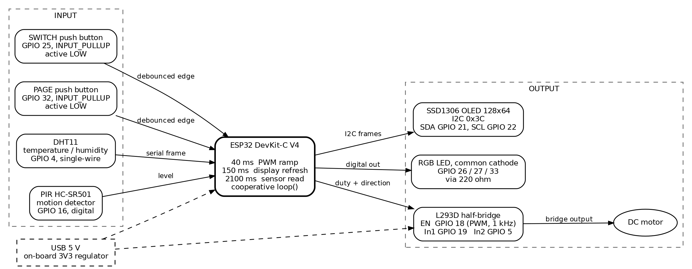
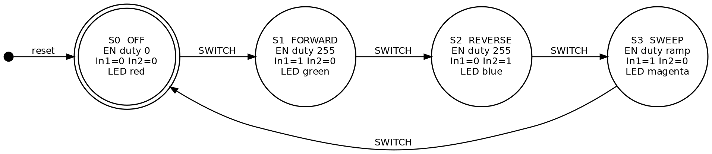
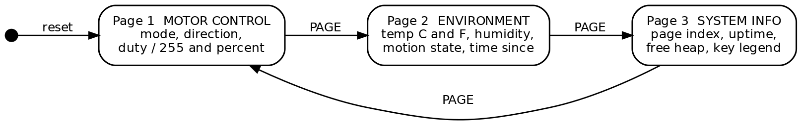
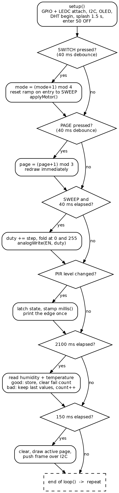
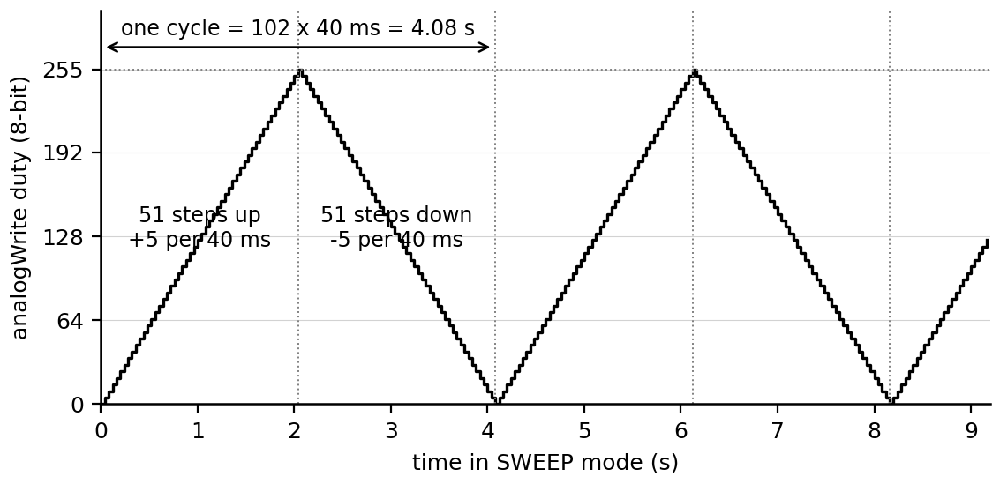
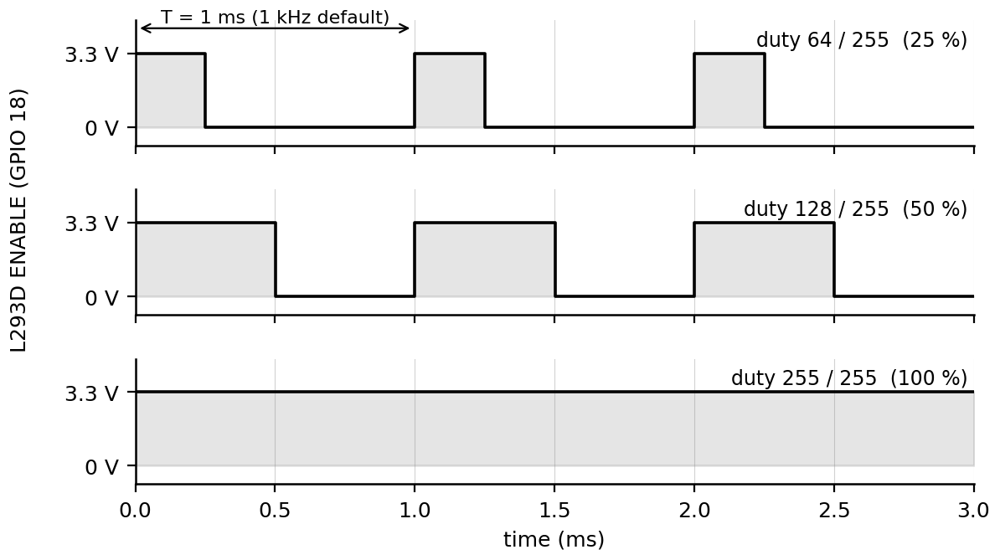
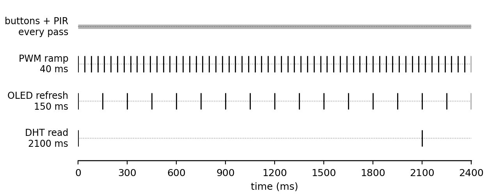

# Lab 1 — ESP32 DC Motor Controller with OLED Telemetry

**Course:** ENGR 4399 ST: Cyber-Physical & IoT Systems
**Instructor:** Dr. Okan Caglayan
**Student:** Daniel Critchlow Jr.
**Type:** In-class lab (bench build, not a graded simulation assignment)
**Date:** September 2026

---

## Project Overview

A single ESP32 runs a four-subsystem control node from one non-blocking
`loop()`. An L293D half-bridge drives a DC motor through four modes — **OFF →
FORWARD → REVERSE → SWEEP** — selected by one debounced push button. A second
button pages through a three-screen SSD1306 OLED dashboard that reports motor
state, temperature and humidity from a DHT11, and motion from a PIR detector.
An RGB LED mirrors the motor mode so the machine state is readable across the
bench without looking at the display.

The point of the lab is **cooperative scheduling**: four jobs that want
service at 40 ms, 150 ms, 2100 ms, and "every pass" all share one thread with
no `delay()` in the control path. Two of those jobs do block while they run,
which is the interesting part of the lab rather than a footnote — see
Engineering Notes.

### What this lab demonstrates

- H-bridge direction control plus PWM amplitude control of a DC motor
- Non-blocking `millis()` scheduling of tasks with three different periods
- Software debounce with edge detection — one action per physical press
- A finite-state machine whose motor outputs are recomputed from state on every
  mode change, so the hardware can never hold a stale combination
- I2C display driving and a paged user interface on 128 × 64 pixels
- A single-wire sensor with graceful failure handling (keep the last good value)
- A level-triggered sensor converted into latched events with a timestamp

## Hardware Components

| Role | Part | Notes |
|------|------|-------|
| Microcontroller | Espressif ESP32 DevKit-C V4 | arduino-esp32 3.x |
| Motor driver | L293D quad half-bridge | One channel pair used, internal clamp diodes |
| Actuator | Brushed DC motor | Driven from the 5 V rail |
| Display | SSD1306 OLED 128 × 64, I2C | Address 0x3C |
| Climate sensor | DHT11 | Single-wire, one reading per 2 s maximum |
| Motion sensor | HC-SR501 PIR | Digital output, self-timed hold |
| Status output | RGB LED, common cathode | Three channels through 220 Ω |
| Input | 2 × momentary push button | Both active LOW on internal pull-ups |

## Pin Map

| ESP32 Pin | Component | Direction | Notes |
|-----------|-----------|-----------|-------|
| GPIO 18 | L293D ENABLE | PWM output | LEDC via `pwmWrite()`, 8-bit at 1 kHz — speed |
| GPIO 19 | L293D In1 (DIRA) | Digital output | Direction bit A |
| GPIO 5 | L293D In2 (DIRB) | Digital output | Direction bit B |
| GPIO 21 | OLED SDA | I2C data | 400 kHz during transfers |
| GPIO 22 | OLED SCL | I2C clock | |
| GPIO 25 | SWITCH button → GND | Digital input | `INPUT_PULLUP`, reads LOW when pressed |
| GPIO 32 | PAGE button → GND | Digital input | `INPUT_PULLUP`, reads LOW when pressed |
| GPIO 4 | DHT11 DATA | Bidirectional | Single-wire, read every 2 s |
| GPIO 16 | PIR OUT | Digital input | Sensor drives the line both ways |
| GPIO 26 | RGB LED — Red via 220 Ω | Digital output | Mode indicator |
| GPIO 27 | RGB LED — Green via 220 Ω | Digital output | Mode indicator |
| GPIO 33 | RGB LED — Blue via 220 Ω | Digital output | Mode indicator |
| 3V3 | OLED, DHT11 | Power | 3.3 V logic rail |
| 5V | PIR, L293D supply | Power | HC-SR501 wants ≥ 4.5 V |
| GND | All returns, RGB common cathode | — | Shared reference |

## Timing Budget

| Job | Period | Constant in `sketch.ino` |
|-----|--------|--------------------------|
| Button sampling and PIR level check | every pass | — |
| Button debounce window | 40 ms | `DEBOUNCE_MS` |
| PWM ramp step (SWEEP only) | 40 ms | `SWEEP_INTERVAL` |
| OLED full-frame refresh | 150 ms | `DISPLAY_INTERVAL` |
| DHT11 read | 2100 ms | `DHT_INTERVAL` |

---

## Figures

**Figure 1 — System block diagram.** Input → process → output, grouped by
subsystem, with every signal labeled by its GPIO.

**Figure 2 — Motor-mode finite-state machine.** Four states, one trigger.
`applyMotor()` writes all three motor outputs from the state alone, so calling
it at any time reproduces the correct hardware state. S3 is the one state whose
output is not fixed by the mode: its enable duty is the ramp variable, so the
machine is Moore only over the extended state (mode, ramp duty).

**Figure 3 — OLED page state machine.** The display is a second, independent
state machine driven by the PAGE button; it never affects motor state.

**Figure 4 — Firmware control flow.** One pass of `loop()`. Every branch is a
test-and-return rather than a wait loop, so no job polls for another. Two of
the branches do occupy the CPU while they run — the DHT read and the frame
push — which is what sets the worst-case pass time.

**Figure 5 — SWEEP duty ramp.** The triangular PWM ramp: ±5 counts every 40 ms
between 0 and 255, giving 51 steps per leg, 2.04 s per leg, and a 4.08 s cycle.

**Figure 6 — PWM at three operating points.** The ENABLE waveform at 25 %,
50 %, and 100 % duty on the 1 kHz `analogWrite` default. At 255 the output is
continuously high — the bridge is simply enabled.

**Figure 7 — Cooperative task cadence.** Each mark is one service of that job
over 2.4 s of run time. The 150 ms refresh is not commensurate with the 40 ms
ramp step (they realign only every 600 ms), and the 2100 ms sensor read is not
a multiple of either, so the three jobs drift in and out of phase with each
other. That is why each one carries its own `millis()` deadline rather than a
counted subdivision of a common tick.

Figures 1–4 are Graphviz; 5–7 are matplotlib. Both are regenerated by
`figures/make_figures.py`, and the `.dot` sources are kept beside the PNGs.

---

## How It Works

**Motor drive.** Direction comes from the two bridge inputs and speed comes
from the enable pin. `applyMotor()` is the only function that writes the motor
outputs, and it writes all three every time it runs, so the hardware can never
hold a stale combination. ENABLE always goes through `pwmWrite()`, a two-line
wrapper over the LEDC peripheral at 1 kHz and 8-bit resolution: duty 0 coasts
the motor and duty 255 is a continuous enable. The wrapper exists because the
core API changed — see Engineering Notes.

**Mode selection.** `MotorMode` is a four-value enum and the SWITCH button
advances it modulo 4 (Figure 2). Entering SWEEP resets the ramp so the mode
always starts from a stopped motor rather than wherever the last sweep left
off.

**Speed ramp.** `updateSweep()` adds `sweepStep` to the duty every 40 ms and
flips the sign of the step at the 0 and 255 limits (Figure 5). It is a state
update plus one register write — no loop, no delay — so the rest of the system
keeps running while the motor accelerates. The deadline advances by
`+= SWEEP_INTERVAL` rather than being re-based on the service time, so a step
delayed by a sensor read or a frame push is made up on the following passes
instead of stretching the ramp; a backlog of more than four intervals is
abandoned rather than chased.

**Debounce.** Both buttons share a `Button` struct holding the debounced level,
the last raw reading, and the time of the last change. A reading is only
promoted to the stable state once it has held for more than 40 ms, and
`buttonPressed()` returns `true` only on the HIGH→LOW promotion. That yields
exactly one event per press, whether the button is tapped or held.

**Display.** Three draw functions, one per page, each rendered into the
framebuffer and pushed as a whole frame. PAGE redraws immediately on press for
instant feedback rather than waiting up to 150 ms for the next scheduled
refresh.

**Climate sensor.** The DHT11 is polled every 2.1 s. Its own floor is 2 s, but
the Adafruit library also re-serves a cached sample for any call inside
2000 ms, so polling at exactly 2000 ms can land a millisecond early and hand
back the previous reading as though it were fresh. A failed read does **not**
blank the screen: the last good values stay, a
failure counter increments, and only after five consecutive failures (≈10 s)
does the page mark the values stale (≈10.5 s at this period). That
distinguishes a dropped frame from a disconnected sensor.

**Motion sensor.** The PIR output is sampled every pass but acted on only when
the level changes, so one physical event produces one Serial line rather than a
flood. The rising edge is timestamped, and the Environment page reports both
the current state and how long ago motion was last seen.

## Engineering Notes

- **Two jobs block, and they can collide.** The DHT11 read is the longest job
  in the loop: the Adafruit driver holds the line low for 20 ms as the start
  signal and then samples 80 bits with interrupts masked, about 25 ms in total.
  The frame push is second: a 128 × 64 monochrome frame is 1024 bytes, each
  costing nine bit times with its ACK, so at the 400 kHz clock the Adafruit
  driver uses during transfers it takes ≈23 ms — and would take ≈92 ms if the
  bus were left at the 100 kHz default. Because 2100 ms and 150 ms are
  unrelated, the two land in the same pass every so often, giving a worst-case
  pass of roughly 50 ms — longer than the 40 ms ramp interval. The ramp
  therefore recovers the missed step on the next pass instead of re-basing its
  deadline, which bounds the error at one step rather than letting it
  accumulate. Getting this fully deterministic would mean moving the ramp into
  an LEDC-driven timer interrupt or a separate FreeRTOS task.
- **`analogWrite()` is younger than the core most tool-chains install.** It
  arrived in arduino-esp32 3.0.0; 2.x has only `ledcSetup()` /
  `ledcAttachPin()` / `ledcWrite()`, and the official PlatformIO `espressif32`
  platform still installs a 2.0.x core. The sketch therefore wraps the two
  APIs in `pwmInit()` / `pwmWrite()` behind an `ESP_ARDUINO_VERSION` check, so
  the same source builds on either core and produces the same 1 kHz, 8-bit
  signal.
- **A pin can only have one owner.** On arduino-esp32 3.x the core records
  which peripheral owns each pin: once LEDC owns ENABLE, a later
  `digitalWrite()` on it is refused with a log line rather than taking effect.
  Writing duty 0 through the same LEDC path is the only way to stop the motor,
  which is exactly what the as-run sketch got wrong.
- **1 kHz is audible.** The default `analogWrite` carrier sits in the middle of
  the audio band, so a driven motor whines. A physical build would raise the
  carrier above ~20 kHz with `analogWriteFrequency()` or a direct LEDC
  configuration; the trade is coarser effective resolution at high frequency.
- **Input-only pins have no pull-ups.** GPIO 34–39 on the ESP32 cannot be
  outputs and have no internal pull-up or pull-down, so a button on one of them
  needs an external resistor. That is why the PAGE button moved to GPIO 32
  (see below).
- **ADC2 is not free.** GPIO 25/26/27 are ADC2 channels, but they are used here
  as plain digital I/O, which avoids the ADC2-versus-Wi-Fi conflict entirely.
- **Common-cathode LED, so HIGH is on.** `setRGB()` is the single place that
  encodes that polarity; a common-anode part would need only that one function
  inverted.
- **The L293D is a bipolar part** and drops roughly 1.5–2 V per side, so the
  motor never sees the full supply. A MOSFET bridge (DRV8833, TB6612) would be
  the modern choice; the L293D is used here because it is what the kit ships.

## Changes from the In-Class Sketch

The sketch as run in class is preserved at
[`original/dc_motor_asrun.ino`](original/dc_motor_asrun.ino). The version in
`sketch/` fixes four defects found while writing this lab up:

| # | In the as-run sketch | In `sketch/sketch.ino` |
|---|----------------------|------------------------|
| 1 | `digitalWrite(ENABLE, HIGH)` in FORWARD and REVERSE, `analogWrite()` in SWEEP, `digitalWrite(ENABLE, LOW)` in OFF. On a 3.x core, once SWEEP has handed ENABLE to LEDC every later `digitalWrite()` on it is silently refused — so OFF could leave the motor spinning at the last sweep duty | One PWM path in all four modes (`pwmWrite()`), with `RUN_DUTY` for the fixed-speed modes and duty 0 for OFF. Lowering `RUN_DUTY` now sets the running speed |
| 2 | The PIR was read twice per pass, printed `"Motion"` with no newline on every pass while the line was high, and `pirValue` was never used | One read per pass, latched on edges, timestamped, printed once per event, and shown on the Environment page |
| 3 | The PAGE button sat on GPIO 35, an input-only pin with no internal pull-up, so it needed an external 10 kΩ resistor that was easy to forget | Moved to GPIO 32 with `INPUT_PULLUP` — one fewer part and one fewer failure mode. To keep the original wiring, set `PAGE_BTN` back to 35 and fit the external pull-up |
| 4 | `Serial.begin(9600)` and a bare `for(;;);` halt on display failure | 115200 baud to match the rest of the repository, and the halt yields with `delay()` so the watchdog is fed |

The pin map is otherwise unchanged and the four modes, three pages, and ramp
constants are the same. The rest of the differences are deliberate but worth
naming so the two files can be diffed without surprises:

- **Page 1** adds the duty percentage next to the raw count.
- **Page 2** is re-laid out to make room for the two new motion rows: Celsius
  and Fahrenheit share a line, the rows move up, and the stale-value warning is
  shortened from 22 characters to 20 so it fits the 21-character line instead
  of wrapping off the bottom of the panel.
- **Page 3** renames "Screen" to "Page" and adds free-heap.
- `SIM_WOKWI` / `DHTTYPE` were added for the simulator substitutions.
- `motorMode` is now the `MotorMode` enum rather than an `int`.
- `DHT_INTERVAL` moved from 2000 ms to 2100 ms, and the ramp deadline now
  advances instead of re-basing — both explained in Engineering Notes.
- `pinMode(ENABLE, OUTPUT)` is gone, since `pwmInit()` claims the pin.

## Simulating in Wokwi

`diagram.json` reproduces the wiring, but the Wokwi part library has no L293D,
no DC motor, and no DHT11, so the diagram makes two substitutions:

| Bench hardware | In `diagram.json` | What is still demonstrated |
|----------------|-------------------|----------------------------|
| L293D + DC motor | Three LEDs with 220 Ω resistors on ENABLE, In1, In2 | Direction bits as a truth table; the PWM ramp appears directly as LED brightness on the ENABLE indicator |
| DHT11 | `wokwi-dht22` | The 2 s poll, the failure path, and the display formatting — but not DHT11 timing |

Because the DHT11 and DHT22 encode their data differently, the library type has
to match the fitted part. Set `SIM_WOKWI` to `1` at the top of the sketch for
the simulator build and back to `0` for the bench build; the OLED labels follow
the switch.

To reproduce in the browser: open a new **ESP32 (Arduino)** project on
[wokwi.com](https://wokwi.com), paste `sketch/sketch.ino` into the code tab and
`diagram.json` into the diagram tab, set `SIM_WOKWI` to 1, then press **Start**.
Click SWITCH to cycle modes and PAGE to change screens.

## Running Locally in VS Code

Requires the **Wokwi for VS Code** and **PlatformIO IDE** extensions. Wokwi
simulates a compiled binary — it does not build the code — so build first.

1. Open this `Lab1` folder as its own VS Code window (`File → Open Folder…`).
   The Wokwi extension reads `wokwi.toml` and `diagram.json` from the folder
   root.
2. Set `SIM_WOKWI` to 1 — either in the sketch or by adding
   `build_flags = -DSIM_WOKWI=1` to `platformio.ini`. `diagram.json` fits a
   DHT22 stand-in, so a DHT11 build reads nothing in the simulator.
3. Build: PlatformIO sidebar → `esp32dev` → **General → Build** (or run
   `pio run`). `platformio.ini` sets `src_dir = sketch` and pulls the four
   Adafruit libraries, producing `.pio/build/esp32dev/firmware.bin` and
   `firmware.elf` — the paths `wokwi.toml` points at.
4. Press `F1` → **Wokwi: Start Simulator**.

The official `espressif32` platform installs an arduino-esp32 2.0.x core; the
sketch's PWM wrapper handles that, so no platform pin is needed.

## Verification

Traced against `sketch/sketch.ino`. **Evidence for every case below is a code
trace, not a captured run** — see Known Limitations.

| # | Input / condition | Expected behavior | Result |
|---|-------------------|-------------------|--------|
| 1 | Power-on | Splash for 1.5 s, then S0 OFF: duty 0, In1 = In2 = 0, LED red, page 1 | Pass — code trace |
| 2 | SWITCH × 1 | S1 FORWARD: In1 = 1, In2 = 0, duty 255, LED green | Pass — code trace |
| 3 | SWITCH × 2 | S2 REVERSE: In1 = 0, In2 = 1, duty 255, LED blue | Pass — code trace |
| 4 | SWITCH × 3 | S3 SWEEP: In1 = 1, In2 = 0, LED magenta, ramp restarts at duty 0 | Pass — code trace |
| 5 | SWITCH × 4 | Wraps to S0 OFF, duty 0 | Pass — code trace |
| 6 | Contact bounce shorter than 40 ms | Debounce suppresses it; exactly one mode advance | Pass — code trace |
| 7 | Button held down | One event on the falling edge only; no repeat | Pass — code trace |
| 8 | PAGE × 1 | Page 2 ENVIRONMENT, redrawn immediately rather than at the next 150 ms tick | Pass — code trace |
| 9 | PAGE × 3 | Wraps back to page 1 MOTOR CONTROL | Pass — code trace |
| 10 | Sustained SWEEP | Duty reaches 255 after 51 steps and returns to 0 after 102, i.e. 2.04 s and 4.08 s of ramp time (Figure 5), with a missed step recovered on the next pass rather than stretching the leg | Pass — code trace |
| 11 | One dropped DHT read | Last good temperature and humidity stay on screen; no warning | Pass — code trace |
| 12 | Five consecutive dropped DHT reads (≈10.5 s) | Page 2 adds the stale-value warning, and the five rows still fit inside 64 px | Pass — code trace |
| 13 | PIR rising edge | Page 2 shows `Motion: ACTIVE`, Serial prints `PIR: motion detected` exactly once, timestamp captured | Pass — code trace |
| 14 | PIR falling edge | Page 2 shows `Motion: clear`, Serial prints `PIR: clear` exactly once, `Last: N s ago` keeps counting up | Pass — code trace |
| 15 | OLED absent at boot | `begin()` fails, message on Serial, firmware halts deliberately with a yielding loop | Pass — code trace |
| 16 | Built against arduino-esp32 2.x or 3.x | The PWM wrapper selects the LEDC or `analogWrite` path; both parse clean | Pass — host parse |
| 17 | `SIM_WOKWI` 0 or 1 | DHT11 and DHT22 paths and the matching OLED labels both parse clean | Pass — host parse |

The two "host parse" rows are reproducible: `tools/hostparse/check.sh` parses
the sketch with `g++ -fsyntax-only -Wall -Wextra` against the stub headers in
that folder, in all four combinations of core version and `SIM_WOKWI`, and all
four are clean. Being a parse against stubs, it proves only that the sketch is
well-formed C++ on every conditional path — it says nothing about the real
libraries or the actual ESP32 core.

## Known Limitations

- **No captured run, and no real compile.** This folder has no simulator
  screenshots and no Serial logs, so every verification case is evidenced by a
  code trace or the host-side parse rather than by an observed run. Nothing
  here is a measured result. The sketch has also never been compiled against
  the real Adafruit libraries and ESP32 core, so the timing figures quoted in
  Engineering Notes (≈25 ms DHT read, ≈23 ms frame push, ≈50 ms worst-case
  pass) are datasheet-and-source estimates, not measurements.
- **The motor stage is not simulated.** Wokwi has no L293D or DC motor part, so
  the substituted LEDs show the control signals but nothing about torque,
  stall current, inertia, or back-EMF.
- **DHT11 timing is not simulated**, because the simulated part is a DHT22.
- **SWEEP ramps in one direction only.** It never reverses mid-sweep, so it
  exercises amplitude control but not four-quadrant operation.
- **Open loop.** There is no tachometer or encoder, so duty is commanded, not
  measured — a loaded motor at duty 128 is slower than an unloaded one.
- **The ramp is not hard real-time.** A single 40 ms step can be late when the
  DHT read and a frame push land in the same pass; the deadline logic bounds
  the error to one step, but a control loop with a real deadline belongs in a
  timer interrupt or its own task.
- **1 kHz carrier.** Audible whine, as noted above; acceptable on a bench, not
  in a product.
- **No motor-supply decoupling in the diagram.** A physical build should add a
  bulk capacitor across the motor supply and keep the motor return out of the
  logic ground path; the L293D's internal clamp diodes handle the inductive
  kick but not the supply sag.
- **`ESP.getFreeHeap()` on page 3 is informational only.** The firmware does no
  dynamic allocation after `setup()`, so a falling heap would indicate a
  library problem rather than a fault in this sketch.

## Files

| File | Description |
|------|-------------|
| `sketch/sketch.ino` | Corrected firmware (the version to build) |
| `original/dc_motor_asrun.ino` | The sketch exactly as run in class, kept for comparison |
| `diagram.json` | Wokwi schematic and wiring, with the substitutions described above |
| `platformio.ini` | PlatformIO build config (ESP32, Arduino framework, library deps) |
| `wokwi.toml` | Wokwi for VS Code simulation config |
| `wokwi-project.txt` | Reproduction note |
| `figures/` | IEEE-style figures plus `make_figures.py` and the Graphviz sources |
| `tools/hostparse/` | Stub headers and `check.sh` for the host-side syntax check |
