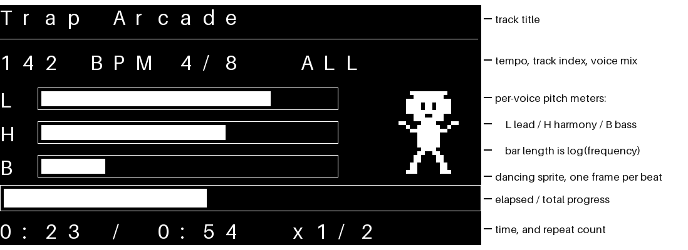
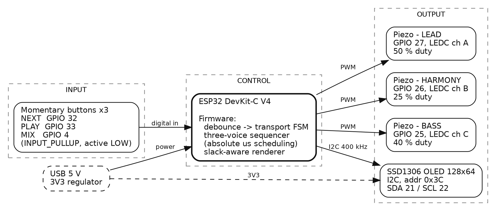
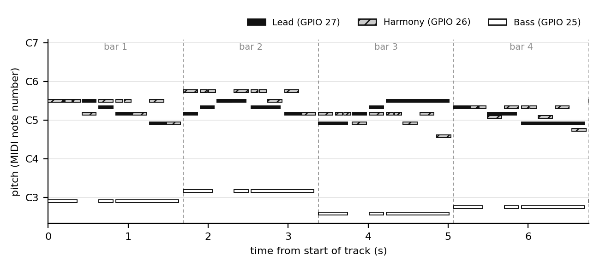
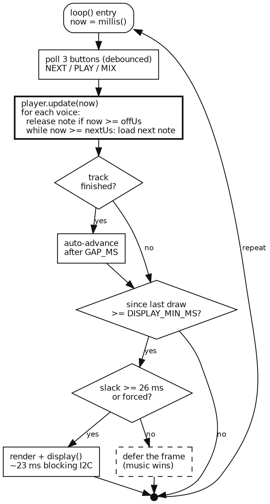
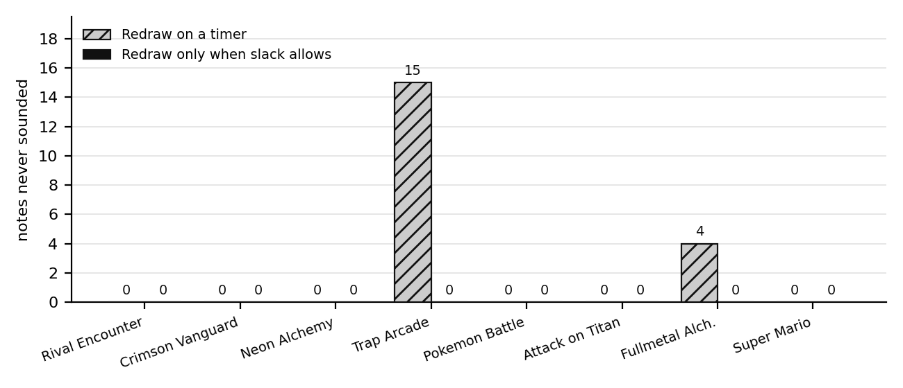
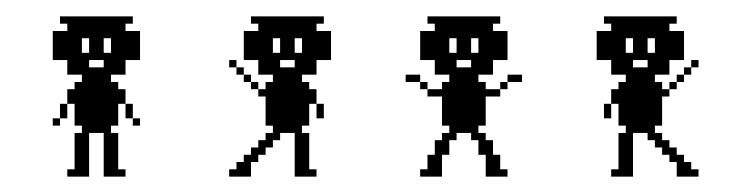
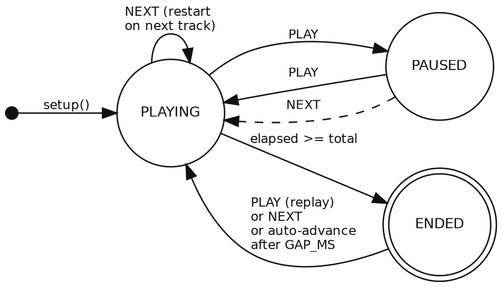

# Lab 2 — ESP32 Three-Voice Chiptune Jukebox

**ENGR 4399 ST: Cyber-Physical & IoT Systems** · University of the Incarnate Word
Daniel Critchlow Jr. · Fall 2026 · Instructor: Dr. Okan Caglayan

Three passive buzzers play lead, harmony and bass simultaneously while an SSD1306
OLED shows the track, a progress bar, live per-voice pitch meters, and a sprite
that dances on the beat. Three buttons are the entire interface.



---

## What this lab is actually about

The in-class version played one buzzer with `tone()` and then sat in `delay()`
for the length of the note. That is the right first program, and it has two hard
limits that this lab exists to break:

1. **`tone()` cannot drive three buzzers.** On arduino-esp32 it owns a single
   LEDC channel and re-points it at whatever pin you named last, so a second
   `tone()` call silences the first.
2. **`delay()` cannot share the CPU.** While it blocks, no other voice can change
   note and no display can be redrawn.

So the lab replaces both: one LEDC channel per buzzer, attached once and never
re-pointed, and a non-blocking sequencer that is called from `loop()` and does
work only when a note is actually due. Everything else — the OLED, the sprite,
the mix control — is built on top of that.



---

## Hardware

### Bill of materials

| Qty | Part | Notes |
|-----|------|-------|
| 1 | ESP32 DevKit-C V4 (or any ESP32 dev board) | arduino-esp32 core **3.x** |
| 3 | Passive piezo buzzer | *Passive*, not active — an active buzzer has its own oscillator and will only ever make one pitch |
| 1 | SSD1306 OLED, 128×64, I²C | address `0x3C` |
| 3 | Momentary push button | no resistors — internal pull-ups |
| — | Breadboard and jumpers | |

### Wiring

| Signal | GPIO | Connection |
|--------|------|------------|
| Buzzer — LEAD | 27 | GPIO → buzzer → GND |
| Buzzer — HARMONY | 26 | GPIO → buzzer → GND |
| Buzzer — BASS | 25 | GPIO → buzzer → GND |
| OLED SDA | 21 | → OLED SDA |
| OLED SCL | 22 | → OLED SCL |
| OLED power | — | 3V3 and GND |
| Button NEXT | 32 | GPIO → button → GND |
| Button PLAY | 33 | GPIO → button → GND |
| Button MIX | 4 | GPIO → button → GND |

All three buttons are `INPUT_PULLUP` and active LOW, so the pin idles high and a
press pulls it to ground. GPIO 25 and 26 double as the ESP32's DAC outputs, but
nothing here uses the DAC — LEDC drives them as ordinary PWM pins, which is all a
passive buzzer needs.

### Controls

| Button | Short press |
|--------|-------------|
| **NEXT** | skip to the next track |
| **PLAY** | pause / resume; restarts the track if it has ended |
| **MIX** | cycle the voice mix: `ALL` → `LEAD` → `LEAD+BASS` |

`MIX` is the one worth demonstrating. Muting a voice does **not** stop its score —
the sequencer keeps stepping through it silently, so un-muting drops the voice
back in exactly where it should be rather than at the beginning. Press it during
a track and you can hear each layer's contribution in isolation.

---

## Running it

### In Wokwi

Open [wokwi.com](https://wokwi.com), start a new **ESP32 (Arduino)** project,
paste `diagram.json` into the diagram tab, then add the sketch files: `sketch.ino`
plus the six headers (`config.h`, `notes.h`, `chiptune.h`, `sprite.h`,
`songs_original.h`, `songs_classic.h`, `songs_user.h`). Add the **Adafruit GFX**
and **Adafruit SSD1306** libraries in the Library Manager tab and press Start.

### On hardware

Arduino IDE → Board **ESP32 Dev Module**, install **Adafruit GFX** and **Adafruit
SSD1306** from Library Manager, open `sketch/sketch.ino`, upload. The Serial
Monitor at 115200 prints the track, its computed length and repeat count on every
change.

### Without any hardware at all

The sequencer builds and runs on a desktop, which is how the timing claims below
were measured:

```bash
cd tools
make verify      # step the real sequencer through every track, check the timing
make stress      # the same, with a blocking display write
make preview     # render every track to a WAV in ../preview so you can hear it
```

`make preview` is the useful one when you are writing music: it renders the exact
note timeline the ESP32 will play as three square-wave voices, so you can check an
arrangement before you ever flash a board.

---

## The playlist

| # | Track | BPM | Voices | One pass | Repeats | Total |
|---|-------|-----|--------|----------|---------|-------|
| 1 | Rival Encounter | 168 | 3 | 22.9 s | ×3 | **68.6 s** |
| 2 | Crimson Vanguard | 152 | 3 | 25.3 s | ×2 | **50.5 s** |
| 3 | Neon Alchemy | 120 | 3 | 32.0 s | ×2 | **64.0 s** |
| 4 | Trap Arcade | 142 | 3 | 27.0 s | ×2 | **54.1 s** |
| 5 | Pokemon Battle | 180 | 1 | 172.0 s | ×1 | **172.0 s** |
| 6 | Attack on Titan | 150 | 1 | 16.0 s | ×4 | **64.0 s** |
| 7 | Fullmetal Alchemist | 135 | 1 | 7.3 s | ×8 | **58.7 s** |
| 8 | Super Mario | 200 | 1 | 92.6 s | ×1 | **92.6 s** |

Tracks 1–4 are original three-voice compositions written for this lab, in
`tools/compose.py`. Tracks 5–8 are the four melodies from the in-class sketch,
carried over unchanged; they are single-voice scores, so they play on the lead
buzzer with the other two silent.

The named tracks are loose arrangements rather than accurate transcriptions —
roughly the right key and shape, but not close enough that you would place them
without the title. Worth knowing before you wire up three buzzers expecting to
recognise something.

**About those durations.** Nothing was padded out by hand. The player computes how
long one pass of a track takes, then repeats it the whole number of times that
lands closest to `TARGET_PLAY_MS` (60 s, in `config.h`):

```
passes = round(60 s / one_pass),  minimum 1
```

That is why a 16-second Attack on Titan intro runs for 64 seconds and a
7.3-second Fullmetal Alchemist phrase runs for 58.7, while Pokemon Battle —
already nearly three minutes — plays once. Change one constant and every track
re-times itself.

---

## How it works

### Three voices

Each buzzer gets its own LEDC channel, attached once in `begin()`:

```cpp
ledcAttach(pin, 1000, LEDC_BITS);        // once, per pin
...
ledcWriteTone(pin, freq);                // set the pitch
ledcWrite(pin, (LEDC_MAX * dutyPct) / 100);   // then the duty
```

The second call is the part that is easy to miss. `ledcWriteTone()` leaves the pin
at 50 % duty, and on a passive buzzer duty does two jobs at once: it sets how much
energy reaches the element (loudness) and it sets the harmonic content of the
square wave (timbre). Lead runs at 50 %, harmony at 25 %, bass at 40 %. The
narrower harmony pulse is quieter and reedier, which keeps it from masking the
lead — the same trick the NES pulse channels used for exactly the same reason.



### Absolute scheduling, not countdowns

The obvious non-blocking sequencer keeps a countdown per voice and reloads it at
zero. That accumulates error: each note is rounded to whole milliseconds, and each
rounding is inherited by every note after it. A lead voice made of sixteenth notes
rounds four times as often as a bass voice made of whole notes, so the two drift
apart — slowly, audibly, and worse the longer the track runs.

Instead every onset is stored as an **absolute** position in 64-bit microseconds
from the start of the track:

```
onset[n+1] = onset[n] + duration[n]
```

A late `update()` delays that one onset and nothing after it, because the next
onset's position was never relative to it. The error is bounded jitter instead of
unbounded drift.

This is measurable rather than theoretical. Swapping the one line
`st.nextUs = onset + d` for the countdown form `st.nextUs = el + d` and re-running
the simulator gives:

| Track | BPM | Whole note (µs) | Exact? | Final note late by | Voices desync by |
|-------|-----|-----------------|--------|--------------------|------------------|
| Rival Encounter | 168 | 1 428 571 | no | 68 ms | 13 ms |
| Crimson Vanguard | 152 | 1 578 947 | no | 34 ms | 48 ms |
| Neon Alchemy | 120 | 2 000 000 | **yes** | 0 ms | 0 ms |
| Trap Arcade | 142 | 1 690 140 | no | 43 ms | 51 ms |
| Pokemon Battle | 180 | 1 333 333 | no | 201 ms | — |
| Attack on Titan | 150 | 1 600 000 | **yes** | 0 ms | — |
| Super Mario | 200 | 1 200 000 | **yes** | 1 ms | — |

*Desync* is the spread between the three voices at the end of a single pass — the
part you actually hear. With absolute scheduling every one of these is 0.

The three tracks that survive the countdown version are the ones whose tempo
divides 240 000 000 evenly, so `wholeUs` has no remainder to accumulate. That is
the tell: a countdown sequencer appears to work fine right up until someone picks
a tempo of 168.

Voice 0 (lead) is authoritative for length. A shorter harmony or bass loops back
to its own beginning underneath it — which is how you write a one-bar bass
ostinato under a sixteen-bar melody — and a longer one is truncated. All three are
realigned at every repeat, so nothing can creep between passes. Any mismatch is
reported over Serial at startup as an `[audit]` line.

### Letting the music win

The OLED is the one thing in the sketch that blocks. A full 128×64 frame is 1024
bytes; at 400 kHz that is roughly **23 ms** inside `display()`. Dropped on top of a
note onset, that is an audibly late note — or, for a short enough note, one that
never sounds at all.

So the renderer asks the sequencer how long it has before the next onset on any
voice, and defers the frame if the answer is under 26 ms:

```cpp
if (since < DISPLAY_FORCE_MS && player.slackUs(now) < DISPLAY_SLACK_US)
  return;                       // the music gets the CPU
```

`DISPLAY_FORCE_MS` guarantees a redraw every 260 ms regardless, so the UI can
never freeze if a track simply never offers a gap.



### Measured result

Both policies pay the same 23 ms per frame. Only the decision of *when* to spend
it differs:



| Policy | Notes lost across all 8 tracks | Frame rate |
|--------|-------------------------------|------------|
| Redraw on a timer | **19** (15 in Trap Arcade, 4 in Fullmetal Alchemist) | ~16 fps |
| Redraw only when slack allows | **0** | 15–16 fps |

The tracks that suffer under the naive policy are the ones with sixteenth-note
runs, which is what you would predict: at 142 BPM a sixteenth is 105 ms, and a
23 ms stall landing near its release is enough to skip it. The slack-aware policy
costs essentially nothing in frame rate because the deferred frames are made up
almost immediately.

Measured with `tools/host_sim`, which runs the real `chiptune.h` against a stub
Arduino API. Reproduce with `make stress`.

### The display



The sprite is four 24×24 frames, 288 bytes of flash total, drawn as pixel art in
`tools/sprite_gen.py` and packed there into the byte layout
`Adafruit_GFX::drawBitmap()` expects. The frame index is
`player.beatIndex(now) % 4` — derived from the song clock, not from a timer — so
the dance is locked to the tempo and speeds up on a faster track for free.

The three meters map frequency to bar length **logarithmically**. Pitch is
logarithmic, so a linear bar would pin the lead to the right edge and leave the
bass motionless at the left.

### Transport



---

## Adding your own track

If the score already exists in a sketch or a text file, don't paste anything —
point the importer at it:

```bash
python3 tools/import_song.py mytrack.txt \
    --voices myLead,myArp,myBass \
    --bpm 190 --title "My Track" --style "Trap" --install
```

That checks the three voices agree in length, refuses to install them if they
don't, and writes `sketch/songs_user.h`. The track then appears at the end of the
playlist — and `make verify` and `make preview` pick it up automatically alongside
the built-in tracks, so you can hear it and check its timing before flashing
anything. Drop `--install` to get the report without writing.

`songs_user.h` holds **any number** of tracks. Installing a title that is already
there replaces just that one and leaves the rest alone, so you can re-import after
an edit without losing anything.

It reads arrays in any of the shapes they turn up in, including the AVR
`const int x[] PROGMEM = {...}` idiom.

Otherwise, edit `sketch/songs_user.h` by hand — it documents the format: three
arrays named `user0Lead` / `user0Harm` / `user0Bass`, a row in the
`USER_SONG_ENTRIES` macro, and `HAVE_USER_SONGS` set to the track count.

The score format is the same flat `{note, divider}` array the original sketch
used, so an existing melody needs no conversion:

```cpp
const int userLead[] = {
  E5,4, E5,8, D5,8, B4,4, A4,4,     // divider: 1=whole 2=half 4=quarter
  B4,4, D5,8, E5,8, E5,2            //          8=eighth 16=sixteenth
};                                   //          negative = dotted (1.5x)
```

### The one rule

**All three voices must contain the same total duration.** A bar of 4/4 sums to
1.0 when you add `1/divider` across it. Two things check this for you: the
importer reports each voice's length in bars and names any that disagree, and the
sketch prints an `[audit]` line over Serial at boot for every voice whose length
does not match its lead.

You do not need to write a minute of music; the repeat logic covers that. Do give
the tempo a thought, though — the same score at 95 BPM rather than 190 is half
speed and one 45 s pass rather than three 23 s ones, which is a different feel and
not just a different length.

### Bass range

`notes.h` runs from **C2 to E7**, so a bass line no longer has to sit in octave 4
for want of a macro. Be aware that a small passive piezo is a high-Q mechanical
resonator and falls off steeply below roughly 200 Hz: an octave-2 line that looks
correct on paper can be nearly inaudible on cheap parts. Either write the bass in
octave 3, or leave it low and set `BASS_OCTAVE_SHIFT` to `12` in `config.h`.

---

## Files

```
Lab2/
├── README.md                    this file
├── EXERCISES.md                 lab exercises
├── diagram.json                 Wokwi schematic and wiring
├── sketch/
│   ├── sketch.ino               playlist, buttons, OLED rendering, loop()
│   ├── config.h                 every pin and tunable in one place
│   ├── chiptune.h               the three-voice sequencer
│   ├── notes.h                  note frequency table, C2..E7
│   ├── sprite.h                 dancing sprite bitmaps      (generated)
│   ├── songs_original.h         four 3-voice compositions   (generated)
│   ├── songs_classic.h          the four in-class melodies  (generated)
│   └── songs_user.h             your track goes here
├── original/
│   └── chiptune_asrun.ino       the single-buzzer version, as run in class
├── figures/                     IEEE-style report figures   (generated)
└── tools/
    ├── Makefile                 make verify / stress / songs / preview
    ├── compose.py               the four original scores; emits songs_original.h
    ├── sprite_gen.py            sprite pixel art; emits sprite.h
    ├── import_song.py           pull scores out of a sketch and check them
    ├── score.py                 shared score reader and timeline model
    ├── host_sim.cpp             runs the real sequencer on a desktop
    ├── verify.py                checks the firmware against the score
    ├── render_wav.py            renders a track to WAV
    ├── make_figures.py          regenerates figures/
    └── hoststub/Arduino.h       minimal Arduino API for the host build
```

Anything marked *generated* is reproduced by `make songs` or
`python3 tools/make_figures.py`; edit the generator, not the output.

**Flash cost:** 17.5 kB of score data, 288 bytes of sprite. Everything is
`const`, so it lives in flash rather than RAM.

---

## Limitations, honestly

- **No bench measurements.** Every timing number here comes from
  `tools/host_sim`, which runs the real sequencer logic against a stub Arduino
  API on a desktop. It models the scheduler exactly, including the cost of a
  display frame, but it does not model interrupt latency, FreeRTOS scheduling on
  the ESP32, or I²C clock stretching. A scope on the buzzer pins would settle
  what the real jitter is; that measurement has not been taken.
- **The 23 ms frame cost is calculated, not measured** — 1024 bytes plus overhead
  at 400 kHz. The real figure depends on the display module and bus capacitance.
- **Three square waves into three separate elements is not a mixer.** The voices
  sum acoustically in the air, so the balance depends on where the buzzers sit
  relative to each other and to you. The duty-cycle settings in `config.h` are a
  starting point, not a calibrated mix.
- **Octave-2 bass may be inaudible** on small piezo elements. See
  `BASS_OCTAVE_SHIFT`.
- **arduino-esp32 3.x only.** `ledcAttach()` and the pin-based `ledcWrite()` do
  not exist on 2.x, where the equivalents are `ledcSetup()` + `ledcAttachPin()`
  and a channel-based `ledcWrite()`.
- **Score data is not validated at compile time.** A voice whose bars do not add
  up will compile and run; it is caught at boot by the `[audit]` line and by
  `tools/import_song.py`, not by the compiler.

---

## References

1. Espressif Systems, *ESP32 Series Datasheet*, and *ESP32 Technical Reference
   Manual*, Ch. "LED PWM Controller (LEDC)".
2. Espressif Systems, *arduino-esp32 3.x API reference* — `ledcAttach()`,
   `ledcWriteTone()`, `ledcWrite()`.
3. Adafruit Industries, *Adafruit GFX Graphics Library* and *Adafruit SSD1306*
   library documentation.
4. Solomon Systech, *SSD1306 Advanced Information*, rev. 1.1.
5. Wokwi, *ESP32 Simulator documentation*, https://docs.wokwi.com.
6. Anthropic — Claude (Cowork), used to assist in building the sequencer,
   composing the original scores, and generating the figures for this lab. All
   engineering content was reviewed by the author.
